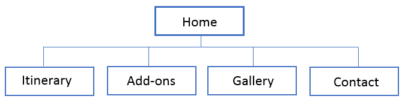
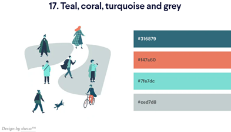
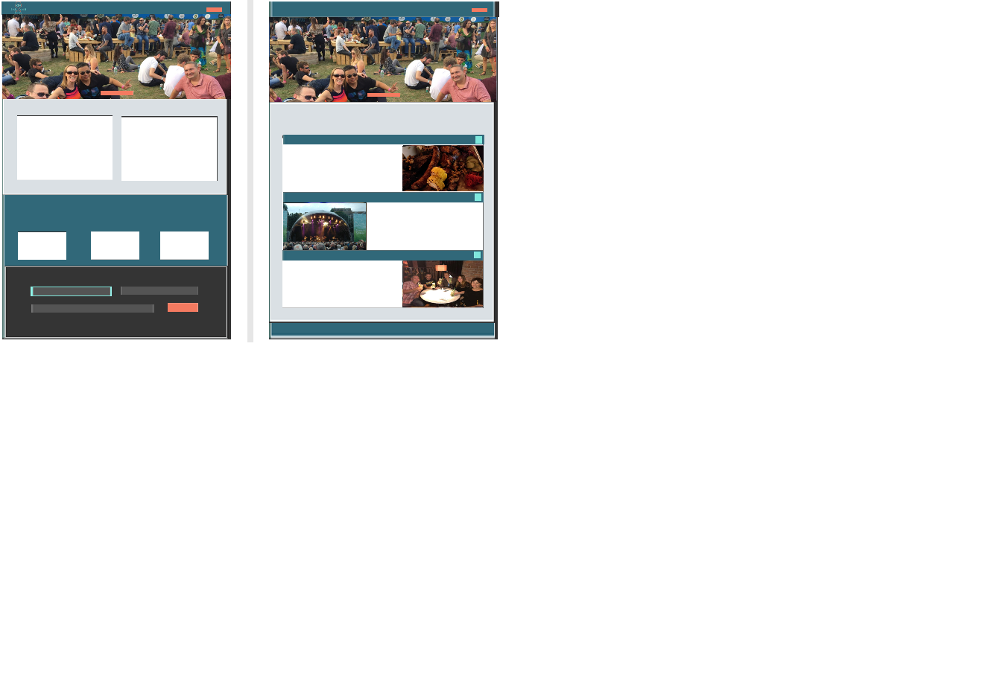

# Irish Spirit Tours
   
    
## Contents:  
## 1. Project Description  
## 2. Goal and Requirements  
### 2.1 Strategy  
* **2.1.1 - Business objectives**  
* **2.1.2 - User needs**  
* **2.1.3 - User persona's** 
## 3. Scope  
* **3.1 - Features**  
* **3.1.1 - Current feature requirements**    
* **3.1.2 - Future feature requirements**  
## 4. Structure  
* ### 4.1 - 
## 5. wireframes
## 6. Visual Design  
## Technologies  
## Testing  
## Deployment  
## Credits 

 
   

## 1. Project Description 
Code Institute: User-Centric Front-End Development  
  
The Milestone 1 project assignment is to build a static front-end website using the technologies that we have learned  
so far on the Code Institute course. I have the option to choose from one of the following three scenarios or to come   
up with my own idea:  
. Build a website for a band (real or fictional)  
. Build a website for a gym  
. Build a personal portfolio site ( potentially for yourself) 
   
I have decided to create a website for a fictional tour company here in Ireland.  However, while the tour company is  
fictional the places featured are real and this was an idea that I had brought forward in September 2019 to the Celbridge  
Tourism and Heritage Forum, of which I'm a voluntary member. Over the last 5 years this voluntary community group has  
sought funding to produce [Celbridge Tourism and Heritage Strategy (2016-2020)](http://www.kildarelcdc.ie/wp-content/uploads/2012/07/Celbridge-Gateway-to-Irelands-AE-Tourism-Heritage-Strategy-May-2016.pdf), [Celbridge Heritage Trail Audio Guide](http://www.abartaheritage.ie/product/celbridge-heritage-trail-audio-guide/)  
and [The Discover Celbridge website](http://www.discovercelbridge.com/).  
While the group have not met since the end of 2019 and our activities have been suspended due to the Covid-19 Pandemic  
and the devastating effects it continues to have across the globe; it is hoped that we will be able to resume our work  
on future projects in late 2021 or early 2022.  
  
The idea for this tour came from the fact that the town of Celbridge, in Co. Kildare, has many historic and cultural sites  
that would appeal to the domestic and international tourism market, but also the realisation that our offering isn't yet  
developed enough to be able to  market Celbridge as a stand-alone tourist destination.  Therefore, my idea was to identify  
other coummunity groups in neighbouring counties who are also working to promote their local area and to collaborate to create  
a ready-made tour itinerary featuring each of our localities and to then pitch it at a number of local tour companies for one  
of them to take on and opperate.  The idea is not for any of the community groups or the individuals involed with them to  
directly benefit from this project. Rather the objective is for our wider communities to benefit from the impact that increased  
tourism will lead to i.e. increased private and public sector investment into improved facilities in these localities.  
  
For the purpose of my Milestone 1 project we're going to assume that the final tour itinerary has been agreed and that the  
fictional family run tour operator, Irish Spirit Tours, has undertaken to incorporate this itinerary into thier business as a  
means of expanding their current product offering.  
  
On that basis I have used the five planes of UX methodology to identify the user needs, the features required, the most logical  
way to structure the information and the functionality required in order to produce a wireframe that will form the blueprint for  
this Milestone project.
 
 
  
## 2. Goal and Requirements 
### 2.1 Strategy  
#### 2.1.1 - Business objectives  
  
### ***Tom O'Donoghue: Owner of Irish Spirit Tours***  
  
Tom started his career in his early 20's working for a chauffeur company that serviced the corporate and high-end leisure market.  
For the 10 years that Tom worked for this company he was a chauffeur and qualified tour guide and he mainly drove 24 seater  
mini-coaches.  In his late 20's Tom got married and started a family, by his early 30's Tom spotted an opportunity to go out  
on his own and he decided to buy his own 16 seater mini-bus and to start operating a series of day-trips from Dublin. Over the  
years the business has grown and Tom has continue to invest in the business by buying a second 16 seater mini-bus and in recent  
years he has replaced his original mini-bus with a brand new luxary 24 seater mini-coach.  
  
Now in his early 50's and his children fully grown, Tom's son Patrick works with Tom on a full-time basis as a tour guide driving  
the 16 seater mini-bus while Tom leads the larger tour groups in the 24 seater mini-coach.  Tom's wife Mary works part-time in a  
local supermarket but she also helps process the bookings for Tom's business. His daughter Grainne recently graduated from  
Trinity College with a degree in Marketing and is now working for a leading multi-national in Dublin's Silicon Docks. Grainne has  
been updating Tom's wordpress website and social media channels for the last 7 years but with her increasing work load in her own  
job this is becoming more of a challenge for Grainne to maintain.

Celbridge Tourism and Heritage Forum approached a number of Irish based tour operators, including Irish Spirit Tours.  The group  
presented their ready-made tour itinerary as a cultural tour of Ireland's Ancient East, which has been designed around some of  
the best Craft Food & Drink producers that lie just beyond the doorstep of Dublin, Ireland's capitol city.  The group highlighted  
how this exciting new tour ties in with Faile Ireland's [FOOD AND DRINK STRATEGY 2018 – 2023](https://www.failteireland.ie/FailteIreland/media/WebsiteStructure/Documents/Publications/FI-Food-Strategy-Document.pdf) and the fact that there  
may be grant opportunities available to companies who are actively involved in developing and promoting products that compliment  
Failte Ireland's strategy.

The group had interest from two of the five tour operators that they approached but Tom was by far the most enthusiastic about  
the new possibilities that this tour itinerary presented his small family run company.  Irish Spirit Tours have traditionally  
promoted their products as a series of day-trips aimed as an add-on to the itineraries of overseas tourists who have already  
made their way to Dublin.  With the creation of this new 6 day tour Tom can see the added value in moving away from offering a  
purely last minute add-on product, to having a tour package that would be the main purpose of his client's trip to Ireland, one  
which is booked and paid for in advance of their arrival into Ireland.

As part of this agreement to operate the tour itinerary Tom has undertaken to commission a new website that is more professional  
and user-friendly.  Tom needs the site to act as his principle tool to promote the tour to international clients.  The site  
needs to look professional and eye-catching, it need to clearly display the details of the tour and the available add-on options  
pre & post tour.  The site needs to offer a streamlined way to process enquiries, quotes and bookings and it needs to be fully  
responsive for multiple device sizes.
  

#### 2.1.2 - User needs:  
    
The user is looking to get more out of their trip to Ireland. They want to get a little bit off the beaten track but they don't want the hassle of having to organise everything   
themselves.  They are interested in seeing some of the culture and history of Ireland's Ancient East but they enjoy sampling quality local food and they are keen to experience  
some of the craft beers & spirits that Ireland is fast establishing a name for.  

The User wants an informative but simple site that shows them the details of the tour and gives them the option to customise the start or end of their tour by booking additional  
nights and activities in Dublin, which is the main gateway city for the majority of international visitors to Ireland.

The user wants a quick and easy way to make enquiries and get a quote via a site that makes them feel confident that they are dealing with a reliable  local tour operator and that   
it is safe to ultimately book their tour via this site.  

#### 2.1.3 - User persona's   
  
So who exactly are the users who are interested in using the internet to search for a tour like this.  Well lets look at the Personas below to discover more about our users:  

### ***Rob - Aged 26 - From London***  
Rob works in the city and lives in trendy Camden with his girlfriend.  Rob is a bit of a self-confessed hipster who is really into the craft beer scene.  Rob wants to surprise  
his girlfriend by booking them a short holiday although neither of them are interested in your standard package sun holiday and his girlfriend is quite into history and culture    
and she is more of a foodie.  Rob has come across a number of award winning craft beers from Ireland recently and decides that Ireland would be the perfect place for them to go  
as he can indulge his passion for craft beer and there's plenty of history and culture to keep his girlfriend happy.  
   
### ***Renate - Aged 35 - From Sao Paulo***  
Renate is a strong independent career focused woman who works for a U.S. multi-national in Sao Paulo and she loves to travel as much as possible. Her favourite program is Game of  
Thrones and her all time favourite film is Braveheart.  For many years she has dreamed of travelling to Europe and in particular Ireland, ever since she realised that Braveheart   
was filmed here.  Renate loves meeting new people and experiencing new cultures and is quite happy to travel by herself but she does prefer to join up with a local tour group once  
she arrives in her destination as she finds this is the best way to meet like-minded people.  https://unsplash.com/photos/D6IZR-YsDYw

### ***Hans - Aged 52 - From Colonge***  
Hans is somewhat of your sterotypical German, he loves beer and is partial to a good Whiskey. He has a beer belly but he says this just shows that he appreciates the finer things  
in life.  When it comes to beer Hans doesn't talk about craft beer, he talks about real beer as Hans doesn't consider these mass produced lagers to be real beer.  Hans has been  
married for 31 years and has two grown-up children.  While Hans and his wife go on holiday together every year they both like to get away separately every other year with a small  
group of their closest friends.  Hans has been to Ireland a number of times before with his work and loves the atmophere and the laid-back nature of the Irish people he has met.  
When a friend of Hans mentions that he has never been to Ireland but he has read alot recently about the many new mrico-breweries and a resurgence in Irish Distilleries they decide  
that Ireland should be the destination for their next short break.   https://unsplash.com/photos/6anudmpILw4
 
 

## 3. Scope  
### 3.1 - Functional Specification  
#### 3.1.1 - Current feature requirements  
* Fully responsive website that will automatically adapt for for desktop, tablet and mobile devices.
* A navigation bar that will be fixed to the top of the screen so that it is always visible, even as the user scrolls down the page.  
* A unique hero image for each page that will visually communicate the content contained within the page.
* A Home page that will focus the users attention to either the tour itinerary or the options to customise & extend the tour.
* A testimonial section on the Home page to build user trust in the quality of the tour and the tour operator.
* A page that will clearly display the full tour itinerary, tour inclusions and the base starting price based on two people sharing.
* A page that will allow the user to extend their trip either pre or post tour and present a list of Add-On's that will allow the user to customise their tour.
* A gallery page to visually re-enforce the quality of the tour.
* A Contact Us page that will contain a multi-fucntional form to enable the user to make an enquiry, request a quote or make a booking.
* A Get a Quote button on the right of the navbar that will link to the multi-functional form on the Contact Us page.
#### 3.1.2 - Future feature requirements  
* The addition of an interactive map on the Itinerary page.
* The addition of a language selection option so that users can access the site in their own language.
### 3.2 - Content Requirements  
* An overview of the comapny and the main product i.e. the tour.  
* A text area with link to entice the user to explore the full tour itinerary.  
* A text area with link to entice the user to explore the full list of options available to customise the tour.  
* A testimonial section to help build trust with the user.
* A subcription form so that we can stay in contact with the user and work on building their trust until they are ready to book the tour.
* The full tour itinerary
* The tour inclusions
* The full list of optional pre & post tour add-on's.  
* An image gallery to visually re-encfore the quality and value of the tour.
* A multi-functional contact form that can handle enguiries, quotes & bookings.
* Social media links to help re-enforce the brand, to stay connected with the user and for users to use as a promotion tool on our behalf.
 
   
     
## 4. Structure  / Information Design  (IA)
### 4.1 -   

Using Dan Brown's 8 Principles Of Information Architecture as described by [careerfoundry](https://careerfoundry.com/en/blog/ux-design/a-beginners-guide-to-information-architecture/) I now need to group the content (objects) from the contents requirements above so that   
I can define the structure / design (Information Architecture) of the site.  
  
***These 8 principles are:***  
  
***The principle of objects:*** Content should be treated as a living, breathing thing. It has lifecycles, behaviors, and attributes.  
***The principle of choices:*** Less is more. Keep the number of choices to a minimum.  
***The principle of disclosure:*** Show a preview of information that will help users understand what kind of information is hidden if they dig deeper.  
***The principle of exemplars:*** Show examples of content when describing the content of the categories.  
***The principle of front doors:*** Assume that at least 50% of users will use a different entry point than the home page.  
***The principle of multiple classifications:*** Offer users several different classification schemes to browse the site’s content.  
***The principle of focused navigation:*** Keep navigation simple and never mix different things.   
***The principle of growth:*** Assume that the content on the website will grow. Make sure the website is scalable.   

So by applying these principles to the objects of my site I can group them as follows:  
  
***index.html***  
* An overview of the comapny and the main product i.e. the tour.  
* A text area with link to entice the user to explore the full tour itinerary.  
* A text area with link to entice the user to explore the full list of options available to customise the tour.  
* A testimonial section to help build trust with the user.   
  
***tour-itinerary.html***  
* The full tour itinerary  
* The tour inclusions  
  
***add-ons.html***  
* The full list of optional pre & post tour add-on's.  
  
***gallery.html***  
* An image gallery to visually re-encfore the quality and value of the tour.  
  
***contact.html***  
* A multi-functional contact form that can handle enguiries, quotes & bookings.  
  
Objects common to all pages will be located in the ***footer***  
* Social media links to help re-enforce the brand, to stay connected with the user and for users to use as a promotion tool on our behalf. 
* A subcription form so that we can stay in contact with the user and work on building their trust until they are ready to book the tour. 
  

  
   
 

## 5. wireframes
[Desktop](./assets/images/wireframe-desktop.png)    
[Tablet](./assets/images/wireframe-tablet.png)   
[Mobile](./assets/images/wireframe-mobile.png)   
   
   
       
## 6. Visual Design   
For my colour palette I looked at a number of different sites (all of which are referenced in the credits section) but the site that provided the most inspiration was [99designs](https://99designs.ie/blog/creative-inspiration/color-combinations/)  
as it really helped me to visualise how the colours might interact with each other.  So I choose the following colour scheme from 99designs as the basis of my colour palette.  
  
**Hex code: #316879, #F47A60, #7FE7DC, #CED7D8**  
"This complimentary combination blends the peacefulness of blue-green with little pops of coral passion. An elegant gray rounds out the palette."  
  
However, I felt that it wasn't exactly what I needed for my site so I also took elements from the colour schemed used on the [Audley Travel](https://www.audleytravel.com/ie/brazil/tours/in-search-of-the-jaguar) website, as it is one of the sites  
from which I took inspiration when I first started thinking about how I would approach this project. So I subsituted the gray #CED7D8 from the 99designs colour palette with  
the lighter gray #DAE0E4 from the Audley Travel site.  Plus I added two additional tones of gray #545454 #343434 to my colour palette, and again I took these from the colour   
palette used for the Audely Travel site.  
  
The final colour palette that I decided upon is:  
-  `#316879` 
-  `#F47A60`   
-  `#7FE7DC`  
-  `#DAE0E4`  
-  `#545454`
-  `#343434`  

In order to test my colour palette prior to starting to code I've created a partial mock-up of my wireframe for the  
the desktop view and I'm satisfied it works.  
  
  
Having started to apply the styling to the site I feel that the dark blue  `#316879` is not contrasting enough with the rest of the colour palette  
so I have amended to a slightly lighter blue  `#35798e`  
  
# Technologies  
(Rough bullet points to be expanded upon)  
* HMTL  
* CSS  
* Bootstrap navbar  
* Bootstrap grid for layout of the body of each page  
* Bootstrap carousel for testimonials  
* Font Awesome for icons

# Testing  

# Deployment  

# Credits  

.container--nav{
    font-family: 'Merienda+One', cursive;
    font-size: 25px;
    font-weight: bold;
    color: #fff;
    position: fixed;
    z-index: 999;                  /*Credit to: https://stackoverflow.com/questions/23287610/my-fixed-navbar-doesnt-work-properly*/
    background-color: #316879;  /* Credit to: https://www.geeksforgeeks.org/how-to-change-navigation-bar-color-in-bootstrap/ */
    border-bottom-style: ridge;
}
Helped me realise that I just needed to take out the bootstrap class bg-dark instead of trying to override it.
Helped me solve text and div's scrolling over my navbar rather than behind my navbar as intended.

Help me auto-launch modal for Cookie Policy on index.html load   https://www.tutorialrepublic.com/faq/how-to-launch-bootstrap-modal-on-page-load.php#:~:text=You%20can%20use%20the%20Bootstrap,to%20subscribe%20the%20website%20newsletter.
https://www.tutorialrepublic.com/faq/how-to-prevent-bootstrap-modal-from-closing-when-clicking-outside.php

taste.jpg https://secretldn.com/sample-capitals-finest-food-taste-london-festival/
newgrange-sunrise.jpg https://edition.cnn.com/travel/article/newgrange-ireland-stone-age/index.html
trim-castle-hotel-dinner.jpg https://www.thetaste.ie/product/trim-castle-hotel-overnight-offer-thetaste-june18/
3arena.jpg https://www.thegibsonhotel.ie/hotel-near-3arena/

William https://www.rawpixel.com/image/2038195/businessman-with-phone

https://careerfoundry.com/en/blog/ux-design/a-beginners-guide-to-information-architecture/  
https://color.adobe.com/create/color-wheel  
https://www.canva.com/colors/color-wheel/  
https://ie.oberlo.com/blog/color-combinations-cheat-sheet  
https://99designs.ie/blog/creative-inspiration/color-combinations/  
  
https://irelandluxurytravel.com/ireland-tours/ireland-food-tours/
https://www.audleytravel.com/ie/brazil/tours/in-search-of-the-jaguar  
https://breweryhops.com/  
https://www.meetthemakerswicklow.ie/  
https://vagabondtoursofireland.com/tour/6-day-ireland-food-tour#_highlights  
https://www.ireland.com/en-gb/what-is-available/food-and-drink/articles/taste-the-island-food-experiences/  
https://www.cietours.com/en-us/tours/ireland/irish-spirit  
https://www.goirishtours.com/coach-irish-spirit-tour/  
http://www.sacredirishtours.com/testimonial-2/  
https://www.authenticvacations.com/europe/ireland-tours/irish-spirit-tour/   

