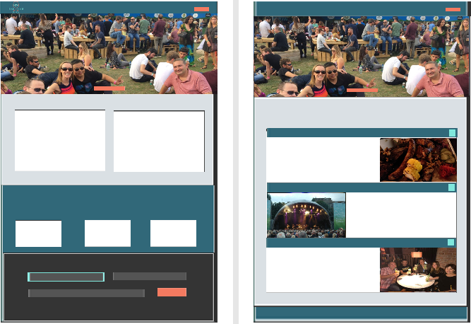
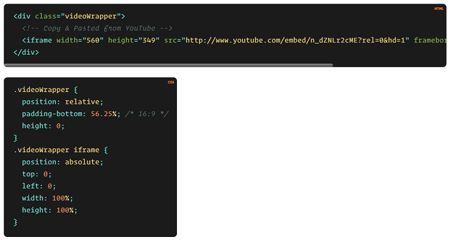

 
# Irish Spirit Tours
<br>    
 
      
## Contents:  
## 1. Project Description  
## 2. User Experience  

* **2.1.1 - Business objectives**  
* **2.1.2 - User needs**  
* **2.1.3 - User persona's** 
## 3. Scope  
* **3.1 - Features**  
* **3.1.1 - Current feature requirements**    
* **3.1.2 - Future feature requirements**  
## 4. Structure  
* ### 4.1 - 
## 5. wireframes
## 6. Visual Design  
## Technologies  
## Testing  
## Deployment  
## Credits 


<br>
<br>  

## 1. Project Description 
Code Institute: User-Centric Front-End Development  
  
The Milestone 1 project assignment is to build a static front-end website using the technologies that we have learned  
so far on the Code Institute course. I have the option to choose from one of the following three scenarios or to come   
up with my own idea:  
. Build a website for a band (real or fictional)  
. Build a website for a gym  
. Build a personal portfolio site ( potentially for yourself) 
   
I have decided to create a website for a fictional tour company here in Ireland.  However, while the tour company is fictional the places featured are real and this was an idea that I had brought forward in September 2019 to the Celbridge Tourism and Heritage Forum, of which I'm a voluntary member. Over the last 5 years this voluntary community group has sought funding to produce [Celbridge Tourism and Heritage Strategy (2016-2020)](http://www.kildarelcdc.ie/wp-content/uploads/2012/07/Celbridge-Gateway-to-Irelands-AE-Tourism-Heritage-Strategy-May-2016.pdf), [Celbridge Heritage Trail Audio Guide](http://www.abartaheritage.ie/product/celbridge-heritage-trail-audio-guide/) and [The Discover Celbridge website](http://www.discovercelbridge.com/). While the group have not met since the end of 2019 and our activities have been suspended due to the Covid-19 Pandemic and the devastating effects it continues to have across the globe; it is hoped that we will be able to resume our work on future projects in late 2021 or early 2022.  
  
The idea for this tour came from the fact that the town of Celbridge, in Co. Kildare, has many historic and cultural sites that would appeal to the domestic and international tourism market, but also the realisation that our offering isn't yet developed enough to be able to  market Celbridge as a stand-alone tourist destination.  Therefore, my idea was to identify other coummunity groups in neighbouring counties who are also working to promote their local area and to collaborate to create a ready-made tour itinerary featuring each of our localities and to then pitch it at a number of local tour companies for one of them to take on and opperate.  The idea is not for any of the community groups or the individuals involed with them to directly benefit from this project. Rather the objective is for our wider communities to benefit from the impact that increased tourism will lead to i.e. the creation of local employment opportunities as well as increased private and public sector investment into improved facilities in these localities.  
  
For the purpose of my Milestone 1 project we're going to assume that the final tour itinerary has been agreed and that the fictional family run tour operator, Irish Spirit Tours, has undertaken to incorporate this itinerary into thier business as a means of expanding their current product offering.  
  
On that basis I have used the five planes of UX methodology to identify the user needs, the features required, the most logical way to structure the information and the functionality required in order to produce a wireframe that will form the blueprint for this Milestone project.
<br>
<br>
  
## 2. Goal and Requirements 
### 2.1 Strategy  


#### 2.1.2 - User Stories:  
    
The user is looking to get more out of their trip to Ireland. They want to get a little bit off the beaten track but they don't want the hassle of having to organise everything themselves.  They are interested in seeing some of the culture and history of Ireland's Ancient East but they enjoy sampling quality local food and they are keen to experience some of the craft beers & spirits that Ireland is fast establishing a name for.  

  - #### First Time Visitor Goals

   1. As a First Time Visitor, I want to easily see the details of the tour.
   2. As a First Time Visitor, I want to easily see the options available to customise the tour.
   3. As a First Time Visitor, I want to be able to navigate the site easily with the minimum number of clicks to get to the desired information.
   4. As a First Time Visitor, I want to look for testimonials to see what reputation the tour operator has and if people enjoyed the tour.
   5. As a First Time Visitor, I want to be able to easily get a quote for the date and options that I'm interested in.
   6. As a First Time Visitor, I want a site that reassures me that I am dealing with a reliable tour operator and that it is safe to book my holiday with them.

   - #### Returning Visitor Goals

   1. As a Returning Visitor, I want to be able to easily contact the tour operator to ask questions and to ask for any clarifications I require.
   2. As a Returning Visitor, I want to be able to find social links to see if any interesting updates or special offers have been posted. 

   - #### Frequent User Goals

   1. As a Frequent User, I want to be able to subcribe to the tour operators Newletter so that I can receive monthly update with information about amendments to the tour, up-coming special events and promotional discounts.


#### 2.1.3 - User personas   

What are User Personas and why use them?  
Well this LinkedIn article by [Boz Zou](https://www.linkedin.com/pulse/how-many-personas-too-boz-zou/) explains that a "Persona is essentially a design tool to create empathy with a group of real users. Personas are fictional characters (but based upon robust research with real people) designed to represent a group of people with similar characters, values, and behaviours. Personas are most useful when they are paired with scenarios to provide contexts and lead to insights thus guide design decisions."  
As per this article by [Jared M. Spool](https://articles.uie.com/benefits_of_personas/) User Personas can help prevent "grounding", if "designers ground themselves in the design, they run the serious risk of creating an interface that only they can use".  Instead of asking, “How would I use this system?” User Personas focus you to ask “How would Rob use the site?”  
While I did not engage in research specific to this project in order to create these User Personas, I did draw on my experience of working in the Irish Travel Industry for 20 years, during which time I dealt with clients and suppliers on a daily basis.  
  
So who exactly are the users who are interested in using the internet to search for a tour like this.  Well lets look at the Personas below to discover more about our users:  

### ***Rob - Aged 26 - From London***  
Rob works in the city and lives in trendy Camden with his girlfriend.  Rob is a bit of a self-confessed hipster who is really into the craft beer scene.  Rob wants to surprise his girlfriend by booking them a short holiday although neither of them are interested in your standard package sun holiday and his girlfriend is quite into history and culture and she is more of a foodie.  Rob has come across a number of award winning craft beers from Ireland recently and decides that Ireland would be the perfect place for them to go as he can indulge his passion for craft beer and there's plenty of history and culture to keep his girlfriend happy.  
   
### ***Renate - Aged 35 - From Sao Paulo***  
Renate is a strong independent career focused woman who works for a U.S. multi-national in Sao Paulo and she loves to travel as much as possible. Her favourite program is Game of Thrones and her all time favourite film is Braveheart.  For many years she has dreamed of travelling to Europe and in particular Ireland, ever since she realised that Braveheart was filmed here.  Renate loves meeting new people and experiencing new cultures and is quite happy to travel by herself but she does prefer to join up with a local tour group once she arrives in her destination as she finds this is the best way to meet like-minded people.  

### ***Hans - Aged 52 - From Colonge***  
Hans is somewhat of your sterotypical German, he loves beer and is partial to a good Whiskey. When it comes to beer Hans doesn't talk about craft beer, he talks about real beer as Hans doesn't consider these mass produced lagers to be real beer.  Hans has been married for 31 years and has two grown-up children.  While Hans and his wife go on holiday together every year they both like to get away separately every other year with a small group of their closest friends.  Hans has been to Ireland a number of times before with his work and loves the atmophere and the laid-back nature of the Irish people he has met. When a friend of Hans mentions that he has never been to Ireland but he has read alot recently about the many new mrico-breweries and a resurgence in Irish Distilleries they decide that Ireland should be the destination for their next short break.  
<br>
  
### ***Tom O'Donoghue: Owner of Irish Spirit Tours***  
  
Tom started his career in his early 20's working for a chauffeur company that serviced the corporate and high-end leisure market. For the 10 years that Tom worked for this company he was a chauffeur and qualified tour guide and he mainly drove 24 seater mini-coaches.  In his late 20's Tom got married and started a family, by his early 30's Tom spotted an opportunity to go out on his own and he decided to buy his own 16 seater mini-bus and to start operating a series of day-trips from Dublin. Over the years the business has grown and Tom has continue to invest in the business by buying a second 16 seater mini-bus and in recent years he has replaced his original mini-bus with a brand new luxary 24 seater mini-coach.  
  
Now in his early 50's and his children fully grown, Tom's son Patrick works with Tom on a full-time basis as a tour guide driving the 16 seater mini-bus while Tom leads the larger tour groups in the 24 seater mini-coach.  Tom's wife Mary works part-time in a local supermarket but she also helps process the bookings for Tom's business. His daughter Grainne recently graduated from Trinity College with a degree in Marketing and is now working for a leading multi-national in Dublin's Silicon Docks. Grainne has been updating Tom's wordpress website and social media channels for the last 7 years but with her increasing work load in her own job this is becoming more of a challenge for Grainne to maintain.


### The Business Scenario  

Celbridge Tourism and Heritage Forum approached a number of Irish based tour operators, including Irish Spirit Tours.  The group presented their ready-made tour itinerary as a cultural tour of Ireland's Ancient East, which has been designed around some of the best Craft Food & Drink producers that lie just beyond the doorstep of Dublin, Ireland's capital city.  The group highlighted how this exciting new tour ties in with Faile Ireland's [FOOD AND DRINK STRATEGY 2018 – 2023](https://www.failteireland.ie/FailteIreland/media/WebsiteStructure/Documents/Publications/FI-Food-Strategy-Document.pdf) and the fact that there may be grant opportunities available to companies who are actively involved in developing and promoting products that compliment Failte Ireland's strategy.

The group had interest from two of the five tour operators that they approached but Tom was by far the most enthusiastic about the new possibilities that this tour itinerary presented his small family run company.  Irish Spirit Tours have traditionally promoted their products as a series of day-trips aimed as an add-on to the itineraries of overseas tourists who have already made their way to Dublin.  With the creation of this new 6 day tour Tom can see the added value in moving away from offering a purely last minute add-on product, to having a tour package that would be the main purpose of his client's trip to Ireland, one which is booked and paid for in advance of their arrival into Ireland.

As part of this agreement to operate the tour itinerary Tom has undertaken to commission a new website that is more professional and user-friendly.  Tom needs the site to act as his principle tool to promote the tour to international clients.  The site needs to look professional and eye-catching, it need to clearly display the details of the tour and the available add-on options pre & post tour.  The site needs to offer a streamlined way to process enquiries, quotes and bookings and it needs to be fully responsive for multiple device sizes.
  
<br>

## 3. Scope  
### 3.1 - Functional Specification  
#### 3.1.1 - Current feature requirements  
* Fully responsive website that will automatically adapt for for desktop, tablet and mobile devices.
* A navigation bar that will be fixed to the top of the screen so that it is always visible, even as the user scrolls down the page.  
* A unique hero image for each page that will visually communicate the content contained within the page.
* A Home page that will focus the users attention to either the tour itinerary or the options to customise & extend the tour.
* A testimonial section on the Home page to build user trust in the quality of the tour and the tour operator.
* A page that will clearly display the full tour itinerary, tour inclusions and the base starting price based on two people sharing.
* A page that will allow the user to extend their trip either pre or post tour and present a list of Add-On's that will allow the user to customise their tour.
* A gallery page to visually re-enforce the quality of the tour.
* A Contact Us page that will contain a multi-fucntional form to enable the user to make an enquiry, request a quote or make a booking.
* A Get a Quote button on the right of the navbar that will link to the multi-functional form on the Contact Us page.
#### 3.1.2 - Future feature requirements  
* The addition of an interactive map on the Itinerary page.
* The addition of a language selection option so that users can access the site in their own language.
### 3.2 - Content Requirements  
* An overview of the comapny and the main product i.e. the tour.  
* A text area with link to entice the user to explore the full tour itinerary.  
* A text area with link to entice the user to explore the full list of options available to customise the tour.  
* A testimonial section to help build trust with the user.
* A subcription form so that we can stay in contact with the user and work on building their trust until they are ready to book the tour.
* The full tour itinerary
* The tour inclusions
* The full list of optional pre & post tour add-on's.  
* An image gallery to visually re-encfore the quality and value of the tour.
* A multi-functional contact form that can handle enguiries, quotes & bookings.
* Social media links to help re-enforce the brand, to stay connected with the user and for users to use as a promotion tool on our behalf.
<br>
<br>  
     
## 4. Structure  / Information Design  (IA)
### 4.1 -   

Using Dan Brown's 8 Principles Of Information Architecture as described by [careerfoundry](https://careerfoundry.com/en/blog/ux-design/a-beginners-guide-to-information-architecture/) I now need to group the content (objects) from the contents requirements above so that   
I can define the structure / design (Information Architecture) of the site.  
  
***These 8 principles are:***  
  
***The principle of objects:*** Content should be treated as a living, breathing thing. It has lifecycles, behaviors, and attributes.  
***The principle of choices:*** Less is more. Keep the number of choices to a minimum.  
***The principle of disclosure:*** Show a preview of information that will help users understand what kind of information is hidden if they dig deeper.  
***The principle of exemplars:*** Show examples of content when describing the content of the categories.  
***The principle of front doors:*** Assume that at least 50% of users will use a different entry point than the home page.  
***The principle of multiple classifications:*** Offer users several different classification schemes to browse the site’s content.  
***The principle of focused navigation:*** Keep navigation simple and never mix different things.   
***The principle of growth:*** Assume that the content on the website will grow. Make sure the website is scalable.   

So by applying these principles to the objects of my site I can group them as follows:  
  
***index.html***  
* An overview of the comapny and the main product i.e. the tour.  
* A text area with link to entice the user to explore the full tour itinerary.  
* A text area with link to entice the user to explore the full list of options available to customise the tour.  
* A testimonial section to help build trust with the user. 
* Newsletter sign-up form so that the company can stay in contact with the user and work on building their trust until they are ready to book the tour.
  
***itinerary.html***  
* The full tour itinerary  
* The tour inclusions & Exclusions   
  
***add-ons.html***  
* The full list of optional pre & post tour add-ons.  
  
***gallery.html***  
* An image gallery to visually re-encfore the quality and value of the tour.  
  
***contact.html***  
* A multi-functional contact form that can handle enquiries, quotes & bookings.  
  
Objects common to all pages will be located in the ***footer***  
* Social media links to help re-enforce the brand, to stay connected with the user and for users to use as a promotion tool on our behalf. 
  

  
<br>  
<br>

## 5. wireframes
[Desktop](https://stephenj2020.github.io/CI-MS1-IrishSpiritTours/assets/images/wireframe-desktop.png)  
     
[Tablet](https://stephenj2020.github.io/CI-MS1-IrishSpiritTours/assets/images/wireframe-tablet.png)  
    
[Mobile](https://stephenj2020.github.io/CI-MS1-IrishSpiritTours/assets/images/wireframe-mobile.png)  
  
 
<br>  
<br>  
       
## 6. Visual Design   
For my colour palette I looked at a number of different sites (all of which are referenced in the credits section) but the site that provided the most inspiration was [99designs](https://99designs.ie/blog/creative-inspiration/color-combinations/)  
as it really helped me to visualise how the colours might interact with each other.  So I choose the following colour scheme from 99designs as the basis of my colour palette.  
  
**Hex code: #316879, #F47A60, #7FE7DC, #CED7D8**  
"This complimentary combination blends the peacefulness of blue-green with little pops of coral passion. An elegant gray rounds out the palette."  
  
However, I felt that it wasn't exactly what I needed for my site so I also took elements from the colour schemed used on the [Audley Travel](https://www.audleytravel.com/ie/brazil/tours/in-search-of-the-jaguar) website, as it is one of the sites  
from which I took inspiration when I first started thinking about how I would approach this project. So I subsituted the gray #CED7D8 from the 99designs colour palette with  
the lighter gray #DAE0E4 from the Audley Travel site.  Plus I added two additional tones of gray #545454 #343434 to my colour palette, and again I took these from the colour   
palette used for the Audely Travel site.  
  
The final colour palette that I decided upon is:  
-  `#316879` 
-  `#F47A60`   
-  `#7FE7DC`  
-  `#DAE0E4`  
-  `#545454`
-  `#343434`  

In order to test my colour palette prior to starting to code I've created a partial mock-up of my wireframe for the  
the desktop view and I'm satisfied it works.  
  
  
Having started to apply the styling to the site I feel that the dark blue  `#316879` is not blending enough with the rest of the colour palette  
so I have amended to a slightly lighter blue  `#35798e`  
  
    
## Technologies Used

### Languages Used

-  [HTML5](https://en.wikipedia.org/wiki/HTML5)

-  [CSS3](https://en.wikipedia.org/wiki/Cascading_Style_Sheets)

  
### Frameworks, Libraries & Programs Used

 [Bootstrap 4.1.3:](https://getbootstrap.com/docs/4.1/getting-started/introduction/)

- Bootstrap Grid was used for responsiveness as well as features such as Collapse, Carousel & Forms.

[Font Awesome 5.6.3:](https://fontawesome.com/)

- Font Awesome was used for the Icons throughout the site.

 [Google Fonts:](https://fonts.google.com/)

- Google Fonts was used to add font families Oswald & Roboto for the site text.

 [jQuery:](https://jquery.com/)

- jQuery used by Bootstrap for features such as Collapse & Carousel.

[Gitpod](https://gitpod.io/)

- Gitpod was the IDE used to create the site and for version control.

[GitHub:](https://github.com/)

- GitHub is used to store the projects code after being pushed from Gitpod.

[Balsamiq:](https://balsamiq.com/)

- Balsamiq was used to create wireframes during the design process.
  
  
## Development Notes:  
  
### Some of the challenges I faced during the Development process and how I addressed them:

-  One of the first issue I encounted was with the fixed Navbar, the page text and images where scrolling over the Navbar rather than behind it.  I googled this issue and I found post on [Stackoverflow](https://stackoverflow.com/questions/23287610/my-fixed-navbar-doesnt-work-properly) which help me realise that I need to add the z-index attribute to my container--nav class in order to elevate the Navbar layer above the rest of the page.

-  The next thing I needed help with was overriding the background colour of the Bootstrap navbar and I found this post [GeeksforGeeks](https://www.geeksforgeeks.org/how-to-change-navigation-bar-color-in-bootstrap/) which helped me figure out that as well as setting the background colour in my container--nav class, which can be viewed on line 44 of style.css, it also helped me realise that rather than trying to override the bootstrap class bg-dark, I could just remove it.

-  I had initially included a modal on index.html for a cookies policy and this article by [TutorialRepublic](https://www.tutorialrepublic.com/faq/how-to-launch-bootstrap-modal-on-page-load.php#:~:text=You%20can%20use%20the%20Bootstrap,to%20subscribe%20the%20website%20newsletter.https://www.tutorialrepublic.com/faq/how-to-prevent-bootstrap-modal-from-closing-when-clicking-outside.php) figure out how to auto-launch the modal upon page load for index.html and it also provided me with a Javascript code snippet to achieve this.  However after speaking with my Mentor at my mid-point review I decided to remove the modal for two reasons. Firstly as I realised that I needed additional Javascript in order to access local storage to be able to save the users input, otherwise the modal for the cookie policy would appear each time index.html was reloaded, i.e. if you navigated to a secondary page and then returned to index.html. The second reason that I decided to remove the modal was because my Mentor expalined that as my site is a static site it isn't actually using cookie so it was wrong to try to include a feature that doesn't actually exist yet and that I should wait until my MS2 before I implement a modal into my project.

-  I wanted to implement a carousel for the client reviews and while I had viewed the carousel options available in [Booststrap](https://getbootstrap.com/docs/4.0/components/carousel/) none of these provided what I wanted and I was unsure of how to properly modify the Bootstrap carousel component to achieve what I wanted.  Therefore I decided to search for an external code snippet that did what I wanted and I found exactly what I was looking for at [Bootsnipp](https://bootsnipp.com/snippets/BxA1B). I actually found it very beneficial doing it this way as I was able to unpick the external code to figure out what each element of it did and once I had done that I was then able to modify the code and apply my own styling to it. In the Bootstrap documentation I had read that data-ride controls the scrolling or slide action of the carousel and I also read about using the data-pause="hover" attribute to make the carousel pause when the user hovers the mouse over the carousel but I was a little unsure of how this worked so I also viewed the [W3Cschools](https://www.w3schools.com/bootstrap/tryit.asp?filename=trybs_ref_js_carousel_pause_data&stacked=h) example of this and I found it very helpful.

-  Another issue I came across while building my site was how to make embedded videos responsive.  Again I turned to google and I found an article by [cssTricks](https://css-tricks.com/fluid-width-video/) which had a code snippet to make an iframe video fluid width, which I have used in several places.   
 

-  On some of the videos I didn't want to show the whole video as some of them are a little long. At first I wasn't sure how to achieve this so I read this post by [Business2Community.com](https://www.business2community.com/youtube/embed-youtube-video-specific-start-time-01010991) and turned out that with YouTube videos it's very easy to do!

-  For the Gallery I wanted the a hover zoom effect but I wasn't sure how to achieve this so I turned to this code snippet from [W3Cschools](https://www.w3schools.com/howto/tryit.asp?filename=tryhow_css_zoom_hover)

-  For the contact form I took some design inspiration from [wpforms.com](https://wpforms.com/beautiful-contact-form-designs-you-can-steal/)  
  


# Testing  

<p>
    <a href="https://jigsaw.w3.org/css-validator/check/referer">
        
    </a>
</p>


Bugs  


Carousel for Client Reviews:
I had created an ID called #circle-container to create and format the circle around the first profile picture but then I had reused it for all of the 
profile picture.  But then I had mistakenly re-used this ID for all the other profile pictures as well. To fix this I changed the ID to a Class.
  
Carousel for Client Reviews:
Rectangle borders were different sizes so I adjusted the amount of text visible above the "read more" Bootstrap Collapse link in order to square up  
the boarder of each carousel card.

Contact form I had copied in code from Bootstrap but I had forgot to update the input ID's and had copied and pasted a number of of time.  This was hightlighted 
to me in the Problems tab of Gitpod. To fix this I simply updated each label / imput with a unique ID.  

Newsletter:
The sign-up form was not maintaining it's correct layout on Mobile and Tablets. I added the Bootstrap Form Grid System by add divs with the classes  
.form-row and .form-group and I also adjusted the .Col for Tablet & Desktop to .col-8 with an .offset-2. As per the screenshots the form now displays  
correctly on Mobile, Tablet and Desktop.

Rename add-on.html to add-ons.html to match AI Design.
  
Unintentionally broke the function and layout of the add-ons.html page. Had to use my last commit in Github to identify which classes I had 
inadvertently modified so that i could manually reinstate them. As it turned out the initial fault was caused by the two new classes that I added  
into the add-ons.html file.  These being .overlay--anchor and .overlay, but I didn't think they had caused the problem as the overlay affect did  
display, albeit out of page as the rest of the page layout had changed. I mistakenly made the assumption that it was changes to the .itinerary--container  
that I had made during my previous update to the itinerary.html file as I had forgotten that I had re-used some of the classes from that file to  
create add-ons.html. I then made additional changes to the class .itinerary--container which then made the fault worst. Having retraced my steps using the  
commit log I then realised that it was something with in the two new classes that I had literally just added, that was causing the page layout and function  
to break. I will now examine these two new classes to see if I can identify what the issue is.

  
   <!--"Read More" Text section--> <!-- Bootstrap code that I have added and modified -->
                                                            <div class="card card-body collapse p-0" id="reviewRob" style="border: none;">
                                                                <p class="card card-body collapse p-0" id="reviewRob1" style="border: none;">
                                                                    lucky enough that our dates coincided with the Trinity Summer Series of outdoor concerts - What a wonderful 
                                                                    city centre venue for outdoor concerts!
                                                                </p>
                                                            </div>
                                                            <!-- Read More "collapse" link -->                                
                                                            <div>
                                                                <a data-toggle="collapse" href="#reviewRob,#reviewRob1" role="button" aria-expanded="false" aria-controls="reviewRob">
                                                                    Read more


 <!-- "Read More" Text section--> <!-- Bootstrap code that I have added and modified -->
                                                            <div class="card card-body collapse p-0" id="reviewRenate,renateReview" style="border: none;">
                                                                <p>
                                                                    food here (maybe I shouldn't say that but it's true). Plus 
                                                                    I was so happy to meet many lovely people from many parts of Europe, we were all different ages but everyone was so friendly and happy.
                                                                </p>
                                                            </div>
                                                            <!-- Read More "collapse" link -->                                
                                                            <div>
                                                                <a data-toggle="collapse" href="#reviewRenate" role="button" aria-expanded="false" aria-controls="renateReview">
                                                                    Read more


  https://web.dev/external-anchors-use-rel-noopener/?utm_source=lighthouse&utm_medium=devtools  
  Links to cross-origin destinations are unsafe
May 2, 2019 • Updated Aug 28, 2019
Appears in: Best Practices audits
When you link to a page on another site using the target="_blank" attribute, you can expose your site to performance and security issues:

The other page may run on the same process as your page. If the other page is running a lot of JavaScript, your page's performance may suffer.
The other page can access your window object with the window.opener property. This may allow the other page to redirect your page to a malicious URL.
Adding rel="noopener" or rel="noreferrer" to your target="_blank" links avoids these issues.

  
https://web.dev/uses-rel-preconnect/?utm_source=lighthouse&utm_medium=devtools  
Improve page load speed with preconnect #
Consider adding preconnect or dns-prefetch resource hints to establish early connections to important third-party origins.

<link rel="preconnect"> informs the browser that your page intends to establish a connection to another origin, and that you'd like the process to start as soon as possible.

Establishing connections often involves significant time in slow networks, particularly when it comes to secure connections, as it may involve DNS lookups, redirects, and several round trips to the final server that handles the user's request.

Taking care of all this ahead of time can make your application feel much snappier to the user without negatively affecting the use of bandwidth. Most of the time in establishing a connection is spent waiting, rather than exchanging data.

Informing the browser of your intention is as simple as adding a link tag to your page:

<link rel="preconnect" href="https://example.com">  


<script src="https://code.jquery.com/jquery-3.5.1.slim.min.js" integrity="sha384-DfXdz2htPH0lsSSs5nCTpuj/zy4C+OGpamoFVy38MVBnE+IbbVYUew+OrCXaRkfj" crossorigin="anonymous"></script>

        <script src="https://code.jquery.com/jquery-3.3.1.slim.min.js" integrity="sha384-q8i/X+965DzO0rT7abK41JStQIAqVgRVzpbzo5smXKp4YfRvH+8abtTE1Pi6jizo" crossorigin="anonymous"></script>


## Deployment

### GitHub Pages

This project was deployed to GitHub Pages following these steps:

1. Login to GitHub  
2. Locate the following GitHub Repository name in the Search Bar: StephenJ2020/CI-MS1-IrishSpiritTours  [See Visual Aid](https://github.com/StephenJ2020/CI-MS1-IrishSpiritTours/blob/master/assets/images/github-locate-repo.png)  
3. Click into the repository to view more details
4. Click on Settings, located on the menu tab just below the repository name  [See Visual Aid](https://github.com/StephenJ2020/CI-MS1-IrishSpiritTours/blob/master/assets/images/github-settings.png) 
5. Scroll down to the GitHub Pages section
6. Under Source, select Master in the dropdown menu  [See Visual Aid](https://github.com/StephenJ2020/CI-MS1-IrishSpiritTours/blob/master/assets/images/github-master.png)  
7. Select /(root) in the tab that is next to Branch selector  [See Visual Aid](https://github.com/StephenJ2020/CI-MS1-IrishSpiritTours/blob/master/assets/images/github-root.png)    
8. Click Save and page will automatically refresh
9. Scroll back down again to the GitHub Pages section
10. You will now see a link to the deployed website  [See Visual Aid](https://github.com/StephenJ2020/CI-MS1-IrishSpiritTours/blob/master/assets/images/github-deployed.png)  
11. To view the deployed website [click here!](https://stephenj2020.github.io/CI-MS1-IrishSpiritTours/index.html)  

### Forking the GitHub Repository

By forking the GitHub Repository you make a copy of the original repository on your own GitHub account to view and/or make changes without affecting the original repository by following these simple steps:

1. Log in to GitHub and locate the [StephenJ2020/CI-MS1-IrishSpiritTours Repository](https://github.com/StephenJ2020/CI-MS1-IrishSpiritTours)
2. Near the top of the Repository, on the right-hand side of the screen, locate the "Fork" button.
3. Click this button and you should now have a copy of the original repository in your GitHub account.
  
### Making a Local Clone

1. Log in to GitHub and locate the [StephenJ2020/CI-MS1-IrishSpiritTours Repository](https://github.com/StephenJ2020/CI-MS1-IrishSpiritTours)
2. Under the repository name, click "Clone or download".
3. To clone the repository using HTTPS, under "Clone with HTTPS", copy the link.
4. Open Git Bash
5. Change the current working directory to the location where you want the cloned directory to be made.
6. Type `git clone`, and then paste the URL you copied in Step 3.
```
$ git clone https://github.com/StephenJ2020/CI-MS1-IrishSpiritTours
```
7. Press Enter. Your local clone will be created.
```
$ git clone https://github.com/StephenJ2020/CI-MS1-IrishSpiritTours
> Cloning into `CI-Clone`...
> remote: Counting objects: 10, done.
> remote: Compressing objects: 100% (8/8), done.
> remove: Total 10 (delta 1), reused 10 (delta 1)
> Unpacking objects: 100% (10/10), done.
```

## Credits
  
### Media   
  
Images used on index.html:  
-  [Hero Image for index.html](https://secretldn.com/sample-capitals-finest-food-taste-london-festival/)  Taken from Secret London  
-  [Sunrise over Newgrange](https://edition.cnn.com/travel/article/newgrange-ireland-stone-age/index.html)  Taken from CNN Travel  
-  [The 3 arena](https://www.thegibsonhotel.ie/hotel-near-3arena/)  Taken from the Gibson hotel  
   
     
Images used in client Reviews  
-  [Rob](https://secretldn.com/sample-capitals-finest-food-taste-london-festival/) Taken from Secret London   
-  [Renate](https://unsplash.com/photos/D6IZR-YsDYw) Taken from UnSplash  
-  [Hans](https://unsplash.com/photos/6anudmpILw4) Taken from UnSplash   
-  [William](https://www.rawpixel.com/image/2038195/businessman-with-phone) Taken from Raw Pixel  
-  [Veronica](https://www.rawpixel.com/image/2328676/free-photo-image-woman-people-portrait)  Taken from  Raw Pixel 
-  [Ely](https://www.rawpixel.com/image/326641/urban-life)  Taken from Raw Pixel  
   
     
Images used on itinerary.html:    
-  [Hero Image for itinerary.html](https://youtu.be/td96McUsH5E) Taken from Visit Historic Celbridge   
-  [Dublin](https://www.skyscanner.ie/news/inspiration/best-irish-breakfast-in-dublin) Taken from skyscanner  
-  [eatyard](https://unsplash.com/photos/njMTraScFbQ) Taken from unsplash  
-  [dublin-food-tour](https://www.gites.fr/gites_temple-bar-district-apartments_dublin_h1273335_en.htm)  Taken from Gites Property Rentals  
-  [skerries mills](https://seda.college/blog/en/6-places-near-dublin-to-visit-in-one-day/skerries/) Taken from Seda College    
-  [Boann Distillery Video](https://boanndistillery.ie/the-distillery/our-family-story/) Taken from Official Website  
-  [listoke Gin Distillery](https://pershorepatty.com/2018/10/30/piston-gin/)  Taken from Preshore Patty  
-  [Battle of Boyne](https://www.tripadvisor.ie/Attractions-g21384005-Activities-Oldbridge_County_Meath.html)  Taken from Tripadvisor  
-  [carlingford Beer Garden](https://www.irelandbeforeyoudie.com/top-5-pubs-in-carlingford/)  Taken from Ireland Before You Die  
-  [Carlingford Brewing Co.](http://www.carlingfordbrewing.ie/brewerytours.php)  Taken from Official Website  
-  [Newgrange Passage Tomb](https://www.sciencemag.org/news/2020/06/dna-ancient-irish-tomb-reveals-incest-and-elite-class-ruled-early-farmers)  Taken from Science Mag    
-  [slane Distillery](https://www.google.com/maps/uv?pb=!1s0x486746125ffde89f%3A0x217aa9deb4b9a382!3m1!7e115!4shttps%3A%2F%2Flh5.googleusercontent.com%2Fp%2FAF1QipPD_S9uRMvo6F-0Q_8vD44VY3x2qDIkCH91iSmK%3Dw241-h160-k-no!5sslane%20distillery%20-%20Google%20Search!15sCgIgAQ&imagekey=!1e10!2sAF1QipPD_S9uRMvo6F-0Q_8vD44VY3x2qDIkCH91iSmK&hl=en&sa=X&ved=2ahUKEwiZyJKM2IPvAhX1URUIHRRbC4AQoiowJHoECEQQAw)  Taken from Google    
-  [Boyne Valley Cheese](https://www.hinterland.ie/p-258-cheese-the-story-of-milk-and-farmhouse-cheese.aspx)  Taken from Hinterland  
-  [Trim Castle Hotel](https://www.thetaste.ie/product/trim-castle-hotel-overnight-offer-thetaste-june18/)  Taken from TheTaste  
-  [Bru Brewing](https://www.tn2magazine.ie/blood-sweat-and-beers/)  Taken from TN2 Magazine   
-  [Castletown House](https://www.discovercelbridge.com/)  Taken from Discover Celbridge    
-  [Visit Historic Celbridge Video](https://www.discovercelbridge.com/)  Taken from Discover Celbridge   
-  [Rye River Brewery](https://stephenj2020.github.io/CI-MS1-IrishSpiritTours/assets/images/rye-river-brewing.png)  My Own Image  
-  [Lilly Obrien Chocolate](https://www.nytimes.com/2015/11/15/travel/dublin-ireland-chocolate.html)  Taken from NY Times  
-  [Glendalough Upper Pass](https://www.tripadvisor.ie/Tourism-g551590-Glendalough_Village_Vale_of_Glendalough_County_Wicklow-Vacations.html)  Taken from Tripadvisor  
-  [Glendalough Upper Lake](https://www.tripadvisor.ie/LocationPhotoDirectLink-g212530-d2085241-i203612151-West_Wicklow_House-Blessington_County_Wicklow.html)  Taken from Tripadvisor  
   
     
Images used on add-ons.html:  
-  [Add-Ons-Hero-Image](https://www.banfflakelouise.com/banff-craft-beer-festival) Taken from Banff Lake Louise  
-  [The Alex Hotel](https://www.thealexhotel.ie/)  Taken from Official Website  
-  [Westbury Hotel](https://www.google.com/travel/hotels/entity/CgoIgI-Zn7-a5apgEAE/lightbox/CAESWGh0dHBzOi8vZDJoeXoyYmZpZjNjcjguY2xvdWRmcm9udC5uZXQvaW1hZ2VSZXBvLzYvMC85MS83NS81Mi9UaGVfV2VzdGJ1cnlfRXh0ZXJpb3JfUy5qcGc?g2lb=2502548%2C2503771%2C2503781%2C4258168%2C4270442%2C4306835%2C4317915%2C4328159%2C4371334%2C4401769%2C4419364%2C4429192%2C4463666%2C4464736%2C4482194%2C4482438%2C4486153%2C4491350%2C4495816%2C4497651%2C4270859%2C4284970%2C4291517&hl=en-IE&gl=ie&grf=EmQKLAgOEigSJnIkKiIKBwjlDxADGBYSBwjlDxADGBcgADAeQMoCSgcI5Q8QAhgcCjQIDBIwEi6yASsSKQonCiUweDQ4NjcwZTljNmQxMDM2NmQ6MHg2MDU1OTRkM2YzZTY0Nzgw&rp=EICPmZ-_muWqYBCAj5mfv5rlqmA4AkAASAHAAQI&ictx=1&sa=X&ved=0CAAQ5JsGahcKEwigmoLvp4vvAhUAAAAAHQAAAAAQAw&utm_campaign=sharing&utm_medium=link&utm_source=htls)  Taken from Google  
-  [Druids Glen Hotel](https://www.druidsglenresort.com/wicklow-golf-club.html)  Taken from Official Website  
-  [Teelings Video](https://teelingdistillery.com/)  Taken from Official Website  
-  [Rascals Craft Beer](https://www.google.com/maps/uv?pb=!1s0x486774229ccb1393%3A0x7777f686729881ef!3m1!7e115!4shttps%3A%2F%2Flh5.googleusercontent.com%2Fp%2FAF1QipNHZg7rbbqwPgXzK5vVQPROiEdvi6BvRZxUgEuo%3Dw234-h160-k-no!5srascals%20-%20Google%20Search!15sCgIgAQ&imagekey=!1e10!2sAF1QipN9-jOSWzhDfEsHJLBd2N0c4SnStsk6xmbnwuI5&hl=en&sa=X&ved=2ahUKEwiOkpyusovvAhV9SBUIHbe4ApAQoiowEnoECCIQAw)  Taken from Google  
-  [Pearse Lyons Distillery](https://www.youtube.com/watch?v=DhtypZbMc4s&t=2s) Taken from YouTube  
-  [zip-lining](https://carlingford.ie/locations/ziplining/)  Taken from Carlingford.ie  
-  [Mountain Biking](http://www.copperharbor.org/activities-recreation/mountain-biking/)  Taken from Copper Harbor  
-  [Abseiling](https://www.discoverireland.ie/louth/family-fun-louth)  Taken from Discover Ireland  
-  [Alltech Craft Brews and Food Fair](https://www.youtube.com/watch?v=eTA_E87Sf5U&t=16s)  Taken from YouTube  
-  [Irish Craft Beer Festival](https://www.youtube.com/watch?v=rIrW0WdCRmU)  Taken from YouTube  
-  [BrewDog Cinematic Circus](https://www.youtube.com/watch?v=v8c_mcrAuaE)  Taken from YouTube  
-  [Forbidden Fruit](https://www.youtube.com/watch?v=AFVFLwDlsPA)  Taken from YouTube  
-  [Trinity Summer Series](https://www.tcd.ie/corporate-services/) Taken from Official Website   
-  [Electric Picnic](https://www.electricpicnic.ie/information/essentials)  Taken from Official Website  

  
Additional Images used in gallery.html:  
-  [Boann Pot Stills](https://boanndistillery.ie/pursuit-pot-still/)  Taken from Official Website  
-  [walking-food-tour](https://unsplash.com/photos/jtLECCiz1e4) Taken from unsplash   
-  [ardgillian](https://avea.ie/ardgillan-castle-ltd/) Taken from Ardgillan Castle Ltd      
-  [wine-food](https://unsplash.com/photos/ZrhtQyGFG6s)  Taken from UnSplash  
-  [group-dinner](https://unsplash.com/photos/QlnUpMED6Qs)  Taken from UnSplash
-  [tacos](https://unsplash.com/photos/R7FA5a7Itnw)  Taken from UnSplash
-  [temple-bar](https://unsplash.com/photos/0kcJVLG1VSo)  Taken from UnSplash

  
Image used on contact.html:  
-  [contact](https://unsplash.com/photos/PSie8BkuB0w)  Taken from UnSplash  
  
Quotes:  
-  The James Joyce quote used at the top of the itinerary.html page was taken from [GoodReads.com](https://www.goodreads.com/quotes/334561-they-lived-and-laughed-and-loved-and-left)
-  The John Keats quote used at the top of the Add-Ons.html page waqs taken from [BrainyQuote.com](https://www.brainyquote.com/quotes/john_keats_137094)  
      
Research for choice of Colour palette:      
-  [Adobe](https://color.adobe.com/create/color-wheel)  
-  [Canva](https://www.canva.com/colors/color-wheel/)  
-  [Oberlo](https://ie.oberlo.com/blog/color-combinations-cheat-sheet)    

    
Tourism site from which I took inspiration when planning my project:  
-  [IrelandLuxuryTravel](https://irelandluxurytravel.com/ireland-tours/ireland-food-tours/)  
-  [AudleyTravel](https://www.audleytravel.com/ie/brazil/tours/in-search-of-the-jaguar)    
-  [BreweryHops](https://breweryhops.com/)  
-  [MeetTheMakers](https://www.meetthemakerswicklow.ie/)  
-  [VagabondToursOf Ireland](https://vagabondtoursofireland.com/tour/6-day-ireland-food-tour#_highlights)  
-  [Ireland.com](https://www.ireland.com/en-gb/what-is-available/food-and-drink/articles/taste-the-island-food-experiences/)  
-  [CIE Tours](https://www.cietours.com/en-us/tours/ireland/irish-spirit)  
-  [GoIrishTours](https://www.goirishtours.com/coach-irish-spirit-tour/)  
-  [SacredIrishTours](http://www.sacredirishtours.com/testimonial-2/)  
-  [AuthenticVacations](https://www.authenticvacations.com/europe/ireland-tours/irish-spirit-tour/)   
  


 
