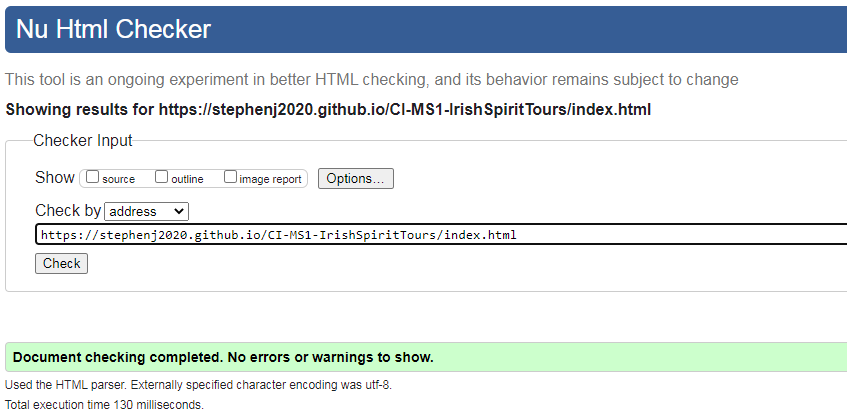
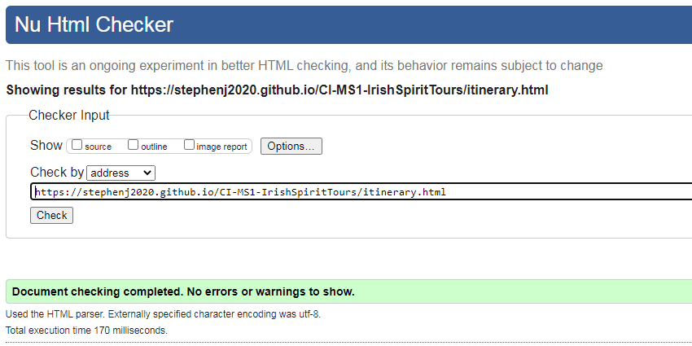

# Contents
- [Contents](#contents)
- [Development Notes:](#development-notes-)
- [Bugs](#bugs)
- [HTML validation](#html-validation)
  * [index.html](#indexhtml)
  * [itinerary.html](#itineraryhtml)
  * [add-ons.html](#add-onshtml)
  * [gallery.html](#galleryhtml)
  * [contact.html](#contacthtml)
- [CSS validation](#css-validation)
- [Accessibility Testing](#accessibility-testing)
- [Responsive Testing](#responsive-testing)

---
  
# Development Notes:  
  
**Some of the challenges I faced during the Development process and how I addressed them:**  

-  One of the first issue I encounted was with the fixed Navbar, the page text and images where scrolling over the Navbar rather than behind it.  I googled this issue and I found post on [Stackoverflow](https://stackoverflow.com/questions/23287610/my-fixed-navbar-doesnt-work-properly) which help me realise that I needed to add the z-index attribute to my container--nav class in order to elevate the Navbar layer above the rest of the page.

-  The next thing I needed help with was overriding the background colour of the Bootstrap navbar and I found this post [GeeksforGeeks](https://www.geeksforgeeks.org/how-to-change-navigation-bar-color-in-bootstrap/) which helped me figure out that as well as setting the background colour in my container--nav class, which can be viewed on line 44 of style.css, it also helped me realise that rather than trying to override the bootstrap class bg-dark, I could just remove it.

-  I had initially included a modal on index.html for a cookies policy and this article by [TutorialRepublic](https://www.tutorialrepublic.com/faq/how-to-launch-bootstrap-modal-on-page-load.php#:~:text=You%20can%20use%20the%20Bootstrap,to%20subscribe%20the%20website%20newsletter.https://www.tutorialrepublic.com/faq/how-to-prevent-bootstrap-modal-from-closing-when-clicking-outside.php) helped me figure out how to auto-launch the modal upon page load for index.html and it also provided me with a Javascript code snippet to achieve this.  However after speaking with my Mentor at my mid-point review I decided to remove the modal for two reasons. Firstly as I realised that I needed additional Javascript in order to access local storage to be able to save the users input, otherwise the modal for the cookie policy would appear each time index.html was reloaded, i.e. if you navigated to a secondary page and then returned to index.html. The second reason that I decided to remove the modal was because my Mentor expalined that as my site is a static site it isn't actually using cookies (which I already understood), it was wrong to try to include a feature that doesn't actually exist yet and that I should wait until my MS2 before I implement a modal into my project.

-  I wanted to implement a carousel for the client reviews and while I had viewed the carousel options available in [Booststrap](https://getbootstrap.com/docs/4.0/components/carousel/) none of these provided what I wanted and I was unsure of how to properly modify the Bootstrap carousel component to achieve what I wanted.  Therefore I decided to search for an external code snippet that did what I wanted and I found exactly what I was looking for at [Bootsnipp](https://bootsnipp.com/snippets/BxA1B). I actually found it very beneficial doing it this way as I was able to unpick the external code to figure out what each element of it did and once I had done that I was then able to modify the code and apply my own styling to it. In the Bootstrap documentation I had read that data-ride controls the scrolling or slide action of the carousel and I also read about using the data-pause="hover" attribute to make the carousel pause when the user hovers the mouse over the carousel but I was a little unsure of how this worked so I also viewed the [W3Cschools](https://www.w3schools.com/bootstrap/tryit.asp?filename=trybs_ref_js_carousel_pause_data&stacked=h) example of this and I found it very helpful.  
    In addition to this, I did face another issue with implementing this code snippet for the Carousel as it didn't follow the Mobile first methodology and was clearly written with desktops in mind.  So this did pose a challenge for me to be able to adapt this code to make it responsive to smaller device screen sizes. The code snippet was formatted in two Carousel rows, each with three cards.  It also has a scroll indicator that appears above the carousel items, two dots, one for each row.  
    I had initially thought I could manage this by just applying the display attribute `d-none` or `d-md-block` to the code snippet as it was, but I soon realised that I couldn't

-  Another issue I came across while building my site was how to make embedded videos responsive.  Again I turned to google and I found an article by [cssTricks](https://css-tricks.com/fluid-width-video/) which had a code snippet to make an iframe video fluid width, which I have used in several places.   
 

-  On some of the videos I didn't want to show the whole video as some of them are a little long. At first I wasn't sure how to achieve this so I read this post by [Business2Community.com](https://www.business2community.com/youtube/embed-youtube-video-specific-start-time-01010991) and turned out that with YouTube videos it's very easy to do!

-  For the Gallery I wanted the a hover zoom effect but I wasn't sure how to achieve this so I turned to this code snippet from [W3Cschools](https://www.w3schools.com/howto/tryit.asp?filename=tryhow_css_zoom_hover)

-  For the contact form I took some design inspiration from [wpforms.com](https://wpforms.com/beautiful-contact-form-designs-you-can-steal/)  
  

---

# Bugs   
  
Carousel for Client Reviews:
I had created an ID called #circle-container to create and format the circle around the first profile picture but then I had reused it for all of the 
profile picture.  But then I had mistakenly re-used this ID for all the other profile pictures as well. To fix this I changed the ID to a Class.
  
Carousel for Client Reviews:
Rectangle borders were different sizes so I adjusted the amount of text visible above the "read more" Bootstrap Collapse link in order to square up  
the boarder of each carousel card.

Contact form I had copied in code from Bootstrap but I had forgot to update the input ID's and had copied and pasted a number of of time.  This was hightlighted 
to me in the Problems tab of Gitpod. To fix this I simply updated each label / imput with a unique ID.  

Newsletter:
The sign-up form was not maintaining it's correct layout on Mobile and Tablets. I added the Bootstrap Form Grid System by add divs with the classes  
.form-row and .form-group and I also adjusted the .Col for Tablet & Desktop to .col-8 with an .offset-2. As per the screenshots the form now displays  
correctly on Mobile, Tablet and Desktop.

  
Unintentionally broke the function and layout of the add-ons.html page. Had to use my last commit in Github to identify which classes I had 
inadvertently modified so that i could manually reinstate them. As it turned out the initial fault was caused by the two new classes that I added  
into the add-ons.html file.  These being .overlay--anchor and .overlay, but I didn't think they had caused the problem as the overlay affect did  
display, albeit out of page as the rest of the page layout had changed. I mistakenly made the assumption that it was changes to the .itinerary--container  
that I had made during my previous update to the itinerary.html file as I had forgotten that I had re-used some of the classes from that file to  
create add-ons.html. I then made additional changes to the class .itinerary--container which then made the fault worst. Having retraced my steps using the  
commit log I then realised that it was something with in the two new classes that I had literally just added, that was causing the page layout and function  
to break. I will now examine these two new classes to see if I can identify what the issue is.

  
   <!--"Read More" Text section--> <!-- Bootstrap code that I have added and modified -->
                                                            

                                                                

                                                                    lucky enough that our dates coincided with the Trinity Summer Series of outdoor concerts - What a wonderful 
                                                                    city centre venue for outdoor concerts!
                                                                

                                                            

                                                            <!-- Read More "collapse" link -->                                
                                                            

                                                                <a data-toggle="collapse" href="#reviewRob,#reviewRob1" role="button" aria-expanded="false" aria-controls="reviewRob">
                                                                    Read more

 <!-- "Read More" Text section--> <!-- Bootstrap code that I have added and modified -->
                                                            

                                                                

                                                                    food here (maybe I shouldn't say that but it's true). Plus 
                                                                    I was so happy to meet many lovely people from many parts of Europe, we were all different ages but everyone was so friendly and happy.
                                                                

                                                            

                                                            <!-- Read More "collapse" link -->                                
                                                            

                                                                <a data-toggle="collapse" href="#reviewRenate" role="button" aria-expanded="false" aria-controls="renateReview">
                                                                    Read more

  https://web.dev/external-anchors-use-rel-noopener/?utm_source=lighthouse&utm_medium=devtools  
  Links to cross-origin destinations are unsafe
May 2, 2019 • Updated Aug 28, 2019
Appears in: Best Practices audits
When you link to a page on another site using the target="_blank" attribute, you can expose your site to performance and security issues:

The other page may run on the same process as your page. If the other page is running a lot of JavaScript, your page's performance may suffer.
The other page can access your window object with the window.opener property. This may allow the other page to redirect your page to a malicious URL.
Adding rel="noopener" or rel="noreferrer" to your target="_blank" links avoids these issues.

  
https://web.dev/uses-rel-preconnect/?utm_source=lighthouse&utm_medium=devtools  
Improve page load speed with preconnect #
Consider adding preconnect or dns-prefetch resource hints to establish early connections to important third-party origins.

<link rel="preconnect"> informs the browser that your page intends to establish a connection to another origin, and that you'd like the process to start as soon as possible.

Establishing connections often involves significant time in slow networks, particularly when it comes to secure connections, as it may involve DNS lookups, redirects, and several round trips to the final server that handles the user's request.

Taking care of all this ahead of time can make your application feel much snappier to the user without negatively affecting the use of bandwidth. Most of the time in establishing a connection is spent waiting, rather than exchanging data.

Informing the browser of your intention is as simple as adding a link tag to your page:

<link rel="preconnect" href="https://example.com">  

        

---

# HTML validation  

-  I used [W3C Markup Validator](https://validator.w3.org) to validate my HTML code and the results for each page can be seen below.

## index.html  
  
  
  
  
- Initially I had a total 54 errors & warnings which is very high although many of these were repeated errors or issues rather than 54 unique issues.  
- Many of these errors were made earlier on in my project but I had failed to pick-up on them and thus had repeated them throughout the project.  
-  The errors & issues were:  
    1. I had included the `px` for pixel in all my image sizes - I now know this is not required and I have corrected this.
    2. In the navbar I had placed a link for "Get a Quote" inside a `<button>` tag, when actually I should have just added the required `btn` classes to the `<a>` anchor tag - This has been corrected.  
    3. My `<h1>` tag was within a `<section>` tag within an `<article>`, this was an incorrect use of the semantic layout.  After checking on Slack I was able to correct this.  
    4. I had incorrectly used the `sr-only` class in multiple places throughout the page.  The warning message was specific that I had miusued the `aria-label` i.e. ``, but at the time I over complicated the solution as I had myself convinced I need some form of `aria-` something when actually I just needed to remove `aria-label`.  I didn't do this, instead this solution I implemented was to remove the `` containing the `sr-only` and to add a `title` attribute to the `div` element immediately below where the `` had been placed. I have now relaise the error in my thought process and while I have left the `title` attributes in place, there are two images that are specified in my `style.css` file and I have since correctly reapplied the `sr-only` class to state what the image is that is below loaded from the css file.    
    5. As referenced in the #Development Notes above, I decided to duplicate my modified code snippet that I used for the Carousel I used for the Client Reviews in order to solve the responsiveness issue I had with it.  However in doing do I had forgotten to modify the unique ID's used in the duplicated blocks of code - This has now been corrected.  
    6. I had some issues with the layout of the footer as I had missing closing tags for some `
`'s and this was also affecting the closing tag of the `</form>` - These have been corrected.
    7. Once these 54 errors and issues had been fixed I validated my code again and a further 16 warnings were picked up regarding my use of `aria-controls` for the `data-toggle="collapse"` functionality within the Carousel. Again I had duplicated the names when I duplicated the code but these weren't picked up by the first validation of my code as they are located on the same lines of code as the `href`'s that had the duplicated ID's.  Again these have now been corrected.
    
To view all changes made to correct the initial 54 issues click [here](https://github.com/StephenJ2020/CI-MS1-IrishSpiritTours/commit/719a3199b44b4d02febadbae4dd0dcdde58cc18d)
      
- All of these issues have now been corrected and my code passed validation.  
   

## itinerary.html       

   
  
- Unfortunately I forgot to save a copy of the intitial validation results for itinerary.html but I had a total 38 errors & warnings.  
- These were pretty much the same issues as described above in list-items 1-4 for index.html, with the majority of the warnings relating to my use of `px` in my image sizing and my use of the `sr-only` class.  
- In addition I had a warning that the `frameborder` attribute for `iFrames` is now obsolete and that this should be handled via css instead.  so I removed this attribute from the html of each `iFrame` and create the class .iframe which can be found on line 38 of `style.css`.
  
To view all changes made to correct these 38 issues click [here](https://github.com/StephenJ2020/CI-MS1-IrishSpiritTours/commit/e67d15feb698975b37c7668eb8995f528affc6cf)  

- All of these issues have now been corrected and my code passed validation.  
   
   

## add-ons.html  
  
  
  
  
- I had a total of 28 errors & warnings.
- Again these were pretty much the same issues as described above in list-items 1-4 for index.html, with the majority of the warnings relating to my use of `px` in my image sizing and my use of the `sr-only` class.
- In addition I had a warning that the `frameborder` attribute for `iFrames` is now obsolete and that this should be handled via css instead.  so I removed this attribute from the html of each `iFrame` and create the class .iframe which can be found on line 38 of `style.css`.
    
To view all changes made to correct the initial 28 issues click [here](https://github.com/StephenJ2020/CI-MS1-IrishSpiritTours/commit/f4ec7c6d14c44711eefcc8e27e2edcc510fde32a)
      
- All of these issues have now been corrected and my code passed validation.  
      
     
  

## gallery.html  
  
  
  
  
- I had a total of 7 errors & warnings.
- Again these were pretty much the same issues as described above in list-items 1-4 for index.html, with the majority of the warnings relating to my use of `px` in my image sizing and the semantic layout issues.
    
To view all changes made to correct the initial 7 issues click [here](https://github.com/StephenJ2020/CI-MS1-IrishSpiritTours/commit/b8a070fcdeaa5cc2ab1408c5c3ba96a933043489)
      
- All of these issues have now been corrected and my code passed validation.  
      
  

## contact.html  
  
  
  
  
- I had a total of 13 errors & warnings.
- Again these were pretty much the same issues as described above in list-items 1-4 for index.html, with the majority of the warnings relating to my use of `px` in my image sizing and the semantic layout issues.
    
To view all changes made to correct the initial 13 issues click [here](https://github.com/StephenJ2020/CI-MS1-IrishSpiritTours/commit/6588bdef70bb48e155d79308792ac7691b3de99c)
      
- All of these issues have now been corrected and my code passed validation.  
         

---  
  
# CSS validation  
  
-  I used [W3C CSS Validator](https://jigsaw.w3.org/css-validator/#validate_by_input) to validate my CSS code and the results for each page can be seen below.

    
- The majority of these errors related to the `background-size` for images declared in `style.css` and to a set of Media Quiries.  
   1. I had used the short-hand format for the properties of the `background-size` attribute but I needed to break these down individually.  
   2. I had used a deprecated verion of a Media Query, instead of `min-device-width` I should have used `min-width`.      
   
To view all changes made to correct the majority of these issues click [here](https://github.com/StephenJ2020/CI-MS1-IrishSpiritTours/commit/41d17ca71f6b86e037b2f4dd591e6ce33346a4a1)
  
However, when I ran my second test I still had the following issues to resolve:    
  
- These issue required only minor adjustments and were simple to fix.

To view all changes made to correct these 3 issues click [here](https://github.com/StephenJ2020/CI-MS1-IrishSpiritTours/commit/0525fd368702e117f85677153fe5b77b7cb209c0)  
  
My CSS code now passed Validation:      
 
  
---  

# Accessibility Testing

Google Lighthouse and WAVE Web Accessibility Evaluation Tool were used to test the site's accessibility. 

The site was also tested manually to make sure that it was navigable by using the tab key, ensuring elements had correct focus states.

  
  
  
  
  
  
---

# Responsive Testing

The site's repsonsiveness was tested using: [Google's Mobile Friendly Tester](https://search.google.com/test/mobile-friendly)  
   
  
-   A Page loading warning does come up for itinerary.html & add-ons.html but the issues relate to the iFrames containing the YouTube videos on these pages and I don't think I can do anything about this as the content of the iFrames is loaded from an external source.
  
I also used Chrome Dev Tools Device Mode to check my site's responsiveness on a number of emulated mobile devices.  This is documented in more detail in the Manual Testing section below.  
  

The site was also tested by manually resizing the browser to check for any issues at uncommon screen sizes.
  - No known issues were found.

---

  